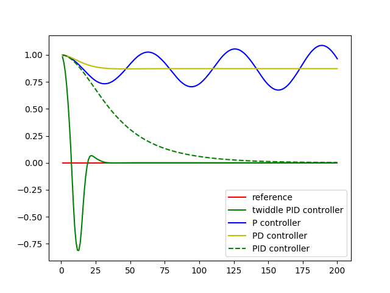

# PID - Proportional Integral Derivative Controller
---
A proportional–integral–derivative controller ([PID](https://en.wikipedia.org/wiki/PID_controller) controller or three term controller) is a control loop feedback mechanism widely used in industrial control systems and a variety of other applications requiring continuously modulated control.

View the result from [YouTube](https://www.youtube.com/watch?v=uT9kPwaf734)


## Effects of components in PID

### Proprotional
This part of the controller which influences the output signal in direct proportion to the error signal that is received. The impact of this component seemed significant since the output signal is sensitive to the changes that is made to this component. Higher the component influence bigger the oscillations. This directly affects the rate at which the system tries to bring down the error. This follows a sinosoidal pattern

### Integral
Since this component punishes the system based on the overall errors the impact from this is not realized immediately on the system. It averages out over a time period and also helps in reducing the system to get corrected locally. This ensures there is less local optimization on our system

### Derivative
This component predicts the error trend and makes the correction using that gradient. We find the difference between the current error and the error that occured in the preceding interval of measurement



## Tuning the Hyperparameters
Initially I started by manually tweaking the parameters and trying to find the parameters that made the car move without crashing at least to few feet. It helped when I tried to keep the other components (I and D) minimal and focussing initially on the P component. I dumped out a CSV file at the end of each run to find out how the trend is with the different metrics. The metrics such as `epoch`, `number of runs`, `cummulated error`, `mean of the error`, and the `standard deviation of the error` was used. Plotting these metrics over a stacked up plot provided a easy way to identify a good hyper parameter. Also using an optimization technique similar to a twiddle method helped. In this technique we try to increase/decrease the parameter value to look for improvements. There is always a risk of the parameters getting stuck in a local optima. 


## Implementation
I used two PID controller. One controls the `steering` and the other controls the `throttle`. The steering controller takes in the Cross Track error (the deviation from the median of the road from the simulator). I used a 
[tanh](http://mathworld.wolfram.com/HyperbolicTangent.html) function to normalize my steering output between `[1, -1]. For the throttle controller I factor in the current speed of the vehicle and the cross track error. By finding the difference between the speed limit that we keep and mulitplying this with the cross track error provides a good way for the system to control the throttle where speed is maximized but the error is minimized.
I used standard deviation of the error as a measure to minimize the error from controller since what we want to achieve is a controller that behaves good overall and not just in one particular section of the road.


## Dependencies

* cmake >= 3.5
 * All OSes: [click here for installation instructions](https://cmake.org/install/)
* make >= 4.1(mac, linux), 3.81(Windows)
  * Linux: make is installed by default on most Linux distros
  * Mac: [install Xcode command line tools to get make](https://developer.apple.com/xcode/features/)
  * Windows: [Click here for installation instructions](http://gnuwin32.sourceforge.net/packages/make.htm)
* gcc/g++ >= 5.4
  * Linux: gcc / g++ is installed by default on most Linux distros
  * Mac: same deal as make - [install Xcode command line tools]((https://developer.apple.com/xcode/features/)
  * Windows: recommend using [MinGW](http://www.mingw.org/)
* [uWebSockets](https://github.com/uWebSockets/uWebSockets)
  * Run either `./install-mac.sh` or `./install-ubuntu.sh`.
  * If you install from source, checkout to commit `e94b6e1`, i.e.
    ```
    git clone https://github.com/uWebSockets/uWebSockets 
    cd uWebSockets
    git checkout e94b6e1
    ```
    Some function signatures have changed in v0.14.x. See [this PR](https://github.com/udacity/CarND-MPC-Project/pull/3) for more details.
* Simulator. You can download these from the [project intro page](https://github.com/udacity/self-driving-car-sim/releases) in the classroom.

There's an experimental patch for windows in this [PR](https://github.com/udacity/CarND-PID-Control-Project/pull/3)

## Basic Build Instructions

1. Clone this repo.
2. Make a build directory: `mkdir build && cd build`
3. Compile: `cmake .. && make`
4. Run it: `./pid`. 
A
Tips for setting up your environment can be found [here](https://classroom.udacity.com/nanodegrees/nd013/parts/40f38239-66b6-46ec-ae68-03afd8a601c8/modules/0949fca6-b379-42af-a919-ee50aa304e6a/lessons/f758c44c-5e40-4e01-93b5-1a82aa4e044f/concepts/23d376c7-0195-4276-bdf0-e02f1f3c665d)


## What next ?
Tuning a PID controller still is not fully automated. Maybe could try a Gradient Descent approach to try and tune these hyperparameters which could be seen as weights in a neural network. Can the same PID controller code be used to automate other systems? Can a game like flappy bird could be controlled using this ? Assuming that we have a good way to get the CTE value I believe this could do a descent job


